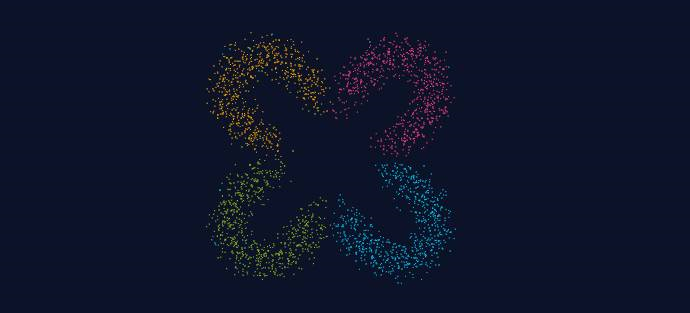
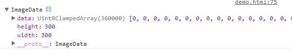
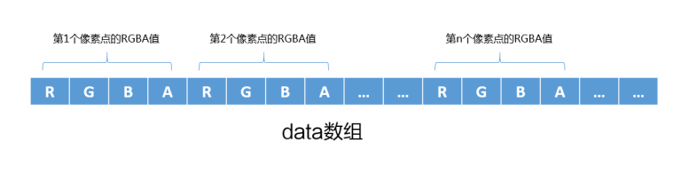
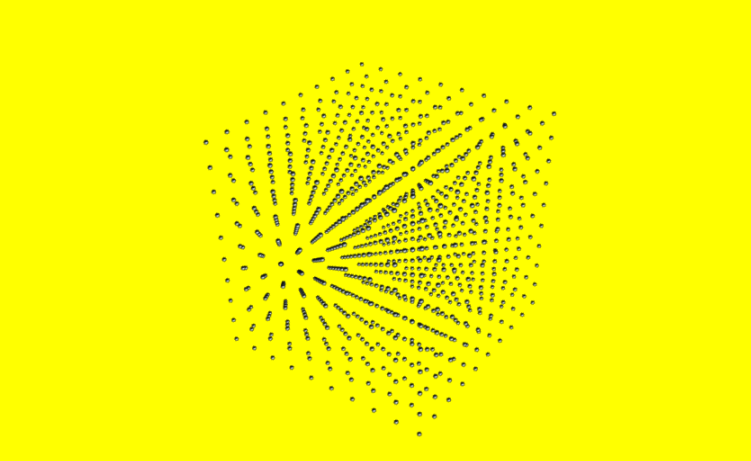
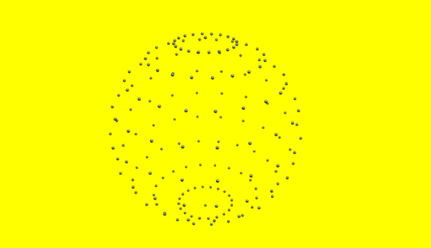

# 制作粒子化图形

## 一：利用getImageData制作   
### 效果图


### HTML5 canvas的新属性 getImageData
```
getImageData(image.x,image.y,image.w,image.h);
//image.x 开始复制的左上角位置的 x 坐标。
//image.y 开始复制的左上角位置的 y 坐标。
//image.w 将要复制的矩形区域的宽度。
//image.h 将要复制的矩形区域的高度。
```
这样即可得到canvas指定区域的RGBA值。
<br>
其中，width、height是读取图像像素信息完整区域的宽度和高度，data是一个Uint8ClampedArray类型的一维数组，包含了整个图片区域里每个像素点的RGBA的整型数据。这里必须要理解这个数组所保存像素信息的排序规则，请看下图描述的data数组：<br>
<br>
图像中第i行第j列的R、G、B、A像素信息就是
```
Rij = [(j-1)*imageData.width + (i-1)]*4 
Gij = [(j-1)*imageData.width + (i-1)]*4 + 1；
Bij = [(j-1)*imageData.width + (i-1)]*4 + 2；
Aij = [(j-1)*imageData.width + (i-1)]*4 + 3 ；
```
而制作粒子化图行的原理就是，得到先把图片用drawImage渲染在canvas上，把有颜色的像素用数组存起来，然后随机挑选100像素进行展示，形成粒子化图形。
```
//计算并保存坐标
function calculate() {
    var len = image.imageData.length;
    //只保存100行，100列的像素值
    var cols = 150,//列
        rows = 150;//行
    //设成150行，100列后每个单元的宽高
    var s_width = parseInt(image.w/cols),   
        s_height = parseInt(image.h/rows);
    var pos = 0; //数组中的位置
    // var par_x, par_y;  //粒子的x,y坐标
    var data = image.imageData.data;  //像素值数组
    console.log(image.imageData)
    for(var i = 0; i < cols; i++) {
        for(var j = 0; j < rows; j++) {
            //计算(i,j)在数组中的R的坐标值
            pos = (j*s_height*image.w + i*s_width)*4;//相当于如果照片的width=1000，只保存100行像素，那么数组应该是10个像素为一个数组
            //判断像素透明度值是否符合要求
            if(data[pos+3] > 100){
                var particle = {
                    //x,y值都随机一下，在自己划分的区域内随机变动20一下像素
                    x: image.x + i*s_width + Math.random()*20,
                    y: image.y + j*s_height + Math.random()*20    
                }
                // 根据图像不同的色值来设定粒子色值
                if(data[pos+1] < 175 && data[pos+2] < 10) {
                    particle.fillStyle = '#ffa900';
                } else if(data[pos+1] < 75 && data[pos+1] > 50) {
                    particle.fillStyle = '#ff4085';
                } else if(data[pos+1] < 220 && data[pos+1] > 190) {
                    particle.fillStyle = '#00cfff';
                } else if(data[pos+1] < 195 && data[pos+1] > 175) {
                    particle.fillStyle = '#9abc1c';
                }
                //符合要求的粒子保存到数组里
                particles.push(particle);
            }
        }
    }
}
```

## 二：利用three.js制作   
查看官网，一番研究之后，利用three生成粒子化图形主要分为两种方法：Sprite和Points。

### Sprite效果图
<br>
看看threejs官网对sprite的解释：A sprite is a plane that always faces towards the camera, generally with a partially transparent texture applied.  
> 原理：生成一个5*5*5的立方体粒子化图形，只需要在特定位置生成5*5*5=250个粒子即可。然后给这250个粒子添加动画效果。
```
// 创建粒子
function creatParticle(){
    let plus_or_minus;//0代表负方向，1代表正方向
    let particle = 5;//立方体的长宽高
    let dis_particle = 5;//粒子之间的距离
    let random_num = 100;//粒子随机的最大距离
        //新建5*5*5个粒子
        for (let x = -particle; x < particle; x++) {
            for (let y = -particle; y < particle; y++) {
                for(let z = -particle; z < particle; z++){
                    //初始化的时候随机分配粒子，plus_or_minus代表往哪一个方向
                    plus_or_minus = Math.floor(Math.random()*2);

                    let sprite = new THREE.Sprite(material);
                    finPosition = {   
                            x:x * dis_particle,
                            y:y * dis_particle,
                            z:z * dis_particle
                            };
                    plus_or_minus == 0?sprite.position.set(-Math.random()*random_num, -Math.random()*random_num, -Math.random()*random_num):sprite.position.set(Math.random()*random_num, Math.random()*random_num, Math.random()*random_num); 
                    positionStart.push(sprite.position); //添加初始位置数组                                    
                    spriteList.push(finPosition);//添加至最终位置数组
                    scene.add(sprite);
                }
            }
        }
}
```

### Points效果图
<br>
看看threejs官网对Points的解释：A class for displaying points. The points are rendered by the WebGLRenderer using gl.POINTS.
```
let geometry = new THREE.SphereGeometry( 30, 50, 50 ,0 ,Math.PI * 3,0 ,Math.PI * 3);
let spriteMap = new THREE.TextureLoader().load( './img/sprite.png' );
let material = new THREE.PointsMaterial( { 
      map:spriteMap
  } ) ;
let mesh = new THREE.Points( geometry, material );
scene.add(mesh);
```
但是有一个缺点：这个方法只能直接渲染，我暂时还没有找不到动画进行渲染。  

所以我稍稍做了一点修改，先用初始化一个SphereGeometry，geometry.vertices是生成这个球体所有点的坐标集合，知道了坐标之后，用sprite进行渲染，方法和上面的正方体一样，即可有动画进入效果。
```
let geometry = new THREE.SphereGeometry( 30, 50, 50 ,0 ,Math.PI * 3,0 ,Math.PI * 3);
let spriteMap = new THREE.TextureLoader().load( './img/sprite.png' );
let material = new THREE.PointsMaterial( { 
      map:spriteMap
} ) ;
let mesh = new THREE.Points( geometry, material );
            
for (let x = 0; x < geometry.vertices.length; x++) {
    let sprite = new THREE.Sprite(material);
    sprite.position.set(geometry.vertices[x].x, geometry.vertices[x].y, geometry.vertices[x].z);
    scene.add(sprite);
}
```
